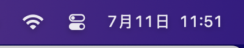

# TokenTray

> 在 macOS 菜单栏实时显示大模型 API 用量，支持智谱 GLM、OpenAI（规划中）、Anthropic（规划中）

[](https://go.dev/)
[](https://www.apple.com/macos/)
[](LICENSE)

TokenTray 是一个轻量级的 macOS 菜单栏工具，帮你实时监控大模型 API 的 token 用量。不用打开浏览器、不用登录控制台，瞄一眼菜单栏就知道额度还剩多少。

## 为什么需要它

如果你在用智谱 GLM Coding Plan（或类似的按额度计费模型），你一定遇到过这些场景：

- **写代码写得正嗨，突然 429 了** — 5 小时窗口或每周额度耗尽，代码补全中断
- **不知道还剩多少额度** — 要切到浏览器、登录控制台、翻几层菜单才能看到
- **多个模型混用，分不清哪个快用完了** — 没有统一的面板

TokenTray 把这些信息放到菜单栏，一秒可见。

## 功能

- **实时用量**：5 小时窗口 + 每周额度的百分比，进度条可视化
- **多额度类型**：Token 限额 + MCP 工具调用配额，一目了然
- **重置倒计时**：每个额度窗口显示距离重置还有多久
- **状态指示灯**：绿/黄/红 三色圆点，扫一眼就知道状态
- **应用内配置**：点菜单栏 → 设置 → 粘贴 API Key → 保存，无需编辑文件
- **多 Provider 架构**：目前支持智谱 GLM，后续添加 OpenAI / Anthropic / DeepSeek
- **原生体验**：Go + AppKit CGO，5MB 二进制，零运行时依赖

## 截图



菜单栏图标显示当前最高用量百分比，点击展开详情。

## 安装

### 方式一：下载 .dmg（推荐）

1. 从 [Releases](../../releases) 页面下载 `TokenTray.dmg`
2. 双击打开，将 TokenTray.app 拖入 Applications 文件夹
3. 启动 TokenTray
4. 点击菜单栏图标 → **设置** → 粘贴智谱 API Key → 保存

### 方式二：从源码构建

```bash
git clone https://github.com/your-username/token-tray.git
cd token-tray
./run.sh rebuild
```

**前提条件**：
- Go 1.21+
- macOS Command Line Tools（`xcode-select --install`）
- macOS 13.0+（MenuBarExtra / NSStatusBar 需求）

## 使用

### 配置 API Key

1. 启动 TokenTray 后，菜单栏出现 `智 ⚠`（未配置状态）
2. 点击图标，展开下拉菜单
3. 点击 **「⚙ 设置…」**
4. 在弹出的对话框中粘贴你的智谱 API Key
5. 点击 **「保存」**

API Key 获取地址：https://open.bigmodel.cn/usercenter/apikeys

### 读懂用量面板

```
🟢 智谱 GLM · MAX                    ← 状态点 + Provider 名 + 套餐等级
   5 小时 Token                      ← 5 小时滚动窗口
   ██░░░░░░░░  22%                   ← 进度条 + 百分比
   ⏳ 3h 12m 后重置                   ← 距离窗口重置
   每周 Token                        ← 7 天滚动窗口
   █░░░░░░░░░  5%
   ⏳ 5d 8h 后重置
   MCP 月度                          ← MCP 工具调用配额
   ░░░░░░░░░░  0%  (0 / 4.0K)
   更新于 14:32:08                   ← 最后刷新时间
```

**状态点含义**：
- 🟢 绿色：用量 < 70%，安全
- 🟡 黄色：用量 70% - 90%，注意
- 🔴 红色：用量 > 90% 或已触发限流，小心

### 高频问题

**Q：菜单栏看不到图标？**

检查以下几点：
1. 确认 macOS 版本 ≥ 13.0
2. 如果装了 Bartender / Ice / Hidden Bar，检查是否把 TokenTray 隐藏了，在管理 App 中设为「常驻显示」
3. macOS 15.3 以下版本可能存在 WindowServer 渲染 bug，升级到 15.7+ 可解决

**Q：显示「API Key 无效或已过期」？**

确认 Key 格式正确（`xxxxxxxx.yyyyyyyyyyyy`，整体一串含中间的点），且从 https://open.bigmodel.cn/usercenter/apikeys 获取。

**Q：支持哪些模型/套餐？**

目前适配智谱 GLM Coding Plan（Lite / Standard / Pro / Max 均可）。按量付费账号也能用，但返回的额度字段可能不同。

## 架构

```
token-tray/
├── main.go              ← 入口，启动 systray 事件循环
├── app.go               ← 菜单栏 UI + 轮询调度 + 设置弹窗
├── provider.go          ← Provider 接口 + UsageReport 数据模型
├── zhipu.go             ← 智谱 GLM provider 实现
├── config.go            ← JSON 配置持久化 (~/.config/token-tray/)
├── format.go            ← 数字/时间/进度条格式化
├── build.sh             ← 编译 + .app bundle 打包
├── run.sh               ← 一键启动脚本
└── tokentray.spec       ← (保留) PyInstaller spec，已弃用
```

### Provider 抽象

所有大模型供应商实现统一的 `Provider` 接口：

```go
type Provider interface {
    Name() string
    ShortLabel() string
    FetchStatus() (*UsageReport, error)
}
```

添加新供应商只需：
1. 创建 `openai.go` / `anthropic.go`，实现 `Provider` 接口
2. 在 `app.go` 的初始化中注册

UI 自动遍历所有已注册的 Provider 并显示。

### 智谱 API

使用智谱开放平台的 Monitor 接口查询额度：

- **端点**：`GET https://open.bigmodel.cn/api/monitor/usage/quota/limit`
- **认证**：`Authorization: <API_KEY>`（注意：没有 `Bearer` 前缀）
- **Coding Plan** 返回两个 `TOKENS_LIMIT` 条目，按 `nextResetTime` 排序后分别为 5 小时窗口和每周窗口

## 开发

```bash
# 开发模式（前台运行，日志输出到终端）
./run.sh debug

# 构建 .app bundle
./build.sh

# 生成 .dmg 安装包
hdiutil create -volname TokenTray -fs HFS+ \
    -srcfolder dist/TokenTray.app -ov -format UDZO dist/TokenTray.dmg
```

## 路线图

- [x] 智谱 GLM Coding Plan 用量监控
- [x] 应用内设置弹窗
- [x] .dmg 安装包
- [ ] OpenAI / ChatGPT Plus 用量
- [ ] Anthropic Claude 用量
- [ ] DeepSeek 用量
- [ ] 自定义刷新间隔
- [ ] 用量超阈值通知
- [ ] 多账号切换
- [ ] App 图标设计

## License

[MIT](LICENSE)
